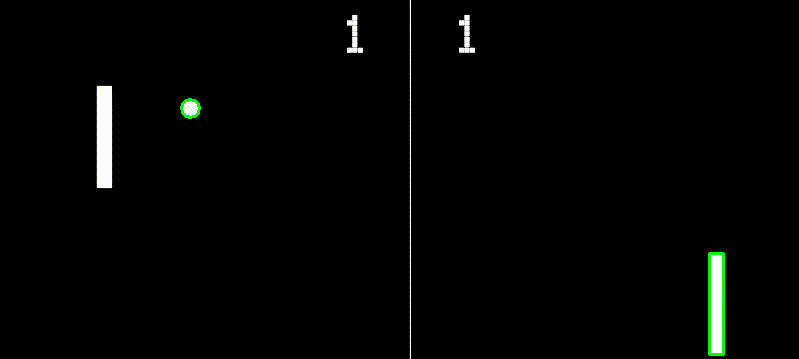

  
   
  
  
   

## Preview

  
   
  <em>Self playing user that analyzes the ball's trajectory and moves the paddle to intercept the ball at the game of Pong.</em>

## Libraries used/developer kit

## How does it work

## Snippet of code image

## Say who gave me the idea

